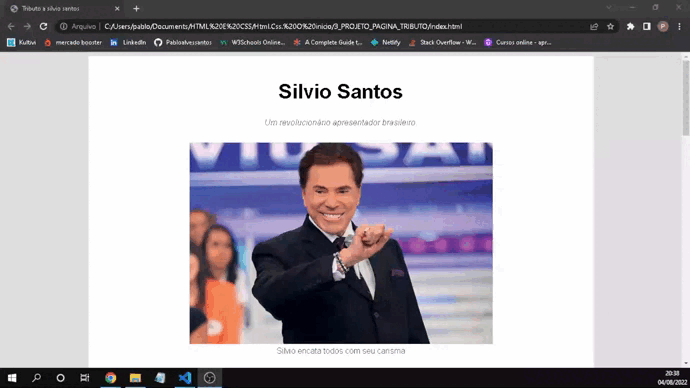

<h1 align="center">PAGINA TRIBUTO</h1>

<h1 align="center">
    
</h1>

 

## 📕 Sobre o projeto 

O **PAGINA DE TRIBUTOS** e uma pagina de tributos a onde foi trabalhado os conceitos de html e nisso usmos a biografia do silvio santos.

## 🛠 Tecnologias

As seguintes ferramentas foram usadas na construção do projeto:

- HTML

Desenvolvido por **Pablo alves santos**

Meu Linkedin: [Pablo.A](https://www.linkedin.com/in/pablo-santos-6b6460243/)